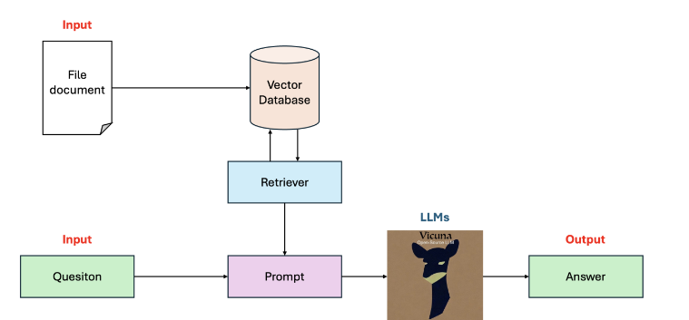

# Project RAG

## 1. Overview
**Large Language Models (LLMs)** are models that allow users to input any text, typically in the form of requests or questions. The model then returns an answer in the form of text that satisfies the user's request.

In LLMs, **Retrieval Augmented Generation (RAG)** is a technique that improves the quality of generated results by integrating content retrieved from a specific source to answer an input question. In this project, we will explore how to build a basic RAG program and apply it to answer questions related to course materials in the AIO course. The Input and Output of the program are as follows:

- Input: The document file to be queried and a question related to the document's content.
- Output: The answer.

Pipeline 



## 2. Installation
Set up Google Colab
- [Click here to open Google Colab notebook](https://colab.research.google.com/) and then log into your account
- Open the `RAG_with_UI.ipynb` file and create a copy
- Change the run time of your notebook from CPU to GPU
- Follow the colab file to run the project

### 2.1 Upload necessary files
- Upload `app.py`, `file.py`, `llm.py`, `vector.py`, and `requirements.txt` files to the Colab notebook
### 2.2 Install necessary dependencies/libs

```sh
!pip install -q -r requirements.txt
```

### 2.3 Run the application
```sh
!python app.py
```

### 2.4 Use Ngrok to Expose Local Server to the Internet
```sh
!pip install pyngrok -q
from pyngrok import ngrok
```

### 2.5 Authenticate Ngrok
- Go to ngrok.com, create an account, and log in.
- Go to Your Authtoken, copy your authtoken.
- Back in Colab, add a new code cell and run:

```sh
!ngrok config add-authtoken "your-authtoken"
public_url = ngrok.connect(8000).public_url
print(public_url)
```

### 2.6 Run the Chainlit app
```sh
!chainlit run app.py
```
- Once it displays http://localhost:8000, click on the public_url printed above.# rag_qa_w_pdf
